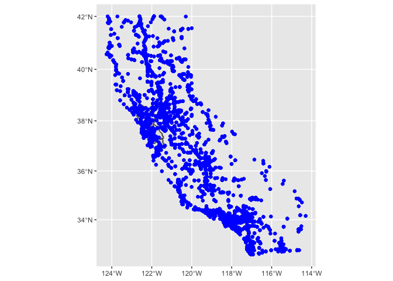
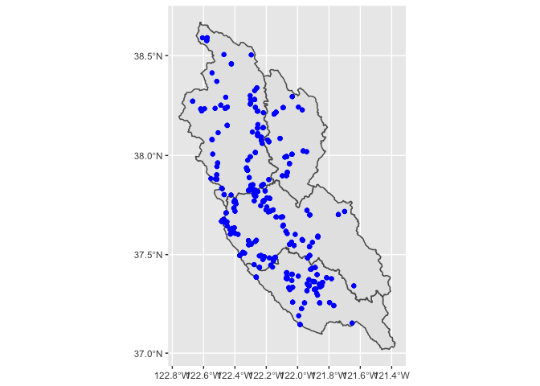

In this document, two files for California Annuals Average Daily Traffic (AADT) counts are downloaded (both from the same agency but download in 2 different ways: ), cut to the study site, and then rejoined. 

# Required packages

```r
library(IETC) # To load packages use > devtools::install_github("WWU-IETC-R-Collab/IETC")
library(tidyverse)
```

```
## ── Attaching packages ─────────────────────────────────────── tidyverse 1.3.0 ──
```

```
## ✓ ggplot2 3.3.3     ✓ purrr   0.3.4
## ✓ tibble  3.1.0     ✓ dplyr   1.0.5
## ✓ tidyr   1.1.3     ✓ stringr 1.4.0
## ✓ readr   1.4.0     ✓ forcats 0.5.1
```

```
## ── Conflicts ────────────────────────────────────────── tidyverse_conflicts() ──
## x dplyr::filter() masks stats::filter()
## x dplyr::lag()    masks stats::lag()
```

```r
library(data.table)
```

```
## 
## Attaching package: 'data.table'
```

```
## The following objects are masked from 'package:dplyr':
## 
##     between, first, last
```

```
## The following object is masked from 'package:purrr':
## 
##     transpose
```

```r
library(sf) # Needed to open and work with shapefile: st_read(), st_write(), etc.
```

```
## Linking to GEOS 3.8.1, GDAL 3.1.4, PROJ 6.3.1
```

```r
library(knitr)
```

# 2019 AADT Traffic Data
[This traffic data](https://gisdata-caltrans.opendata.arcgis.com/datasets/f71f49fb87b3426e9688fe66039170bc_0?geometry=-147.187%2C31.076%2C-91.377%2C43.281) was downloaded from the [CalTrans GIS Database](https://gisdata-caltrans.opendata.arcgis.com/) on March 24, 2021. This data is only 2018 traffic count year (October 1st through September 30th). Additional data from 2013 to 2018 will be added to this document in the next section.

# Load data
The shapefile shown in the code below may not always be available in this working directory. Find it in the Tox Box

```r
traffic.data <- st_read("Data/Traffic_Volumes_AADT/Traffic_Volumes_AADT.shp")
```

```
## Reading layer `Traffic_Volumes_AADT' from data source `/Users/emmasharpe/Documents/B. R Studio /Projects/With GitHub Repos/Cutting_by_RiskRegion/Data/Traffic_Volumes_AADT/Traffic_Volumes_AADT.shp' using driver `ESRI Shapefile'
## Simple feature collection with 3473 features and 24 fields
## Geometry type: MULTIPOINT
## Dimension:     XY
## Bounding box:  xmin: -13833100 ymin: 3835639 xmax: -12723710 ymax: 5161800
## Projected CRS: WGS 84 / Pseudo-Mercator
```


```r
SFB.riskregions <- st_read("Data/SFB_RiskRegions_20210304_SP/SFB_RiskRegions_20210304_SP.shp") %>% # transforms shapefile CRS to WGS84 vs NAD83
  st_transform(st_crs(traffic.data))
```

```
## Reading layer `SFB_RiskRegions_20210304_SP' from data source `/Users/emmasharpe/Documents/B. R Studio /Projects/With GitHub Repos/Cutting_by_RiskRegion/Data/SFB_RiskRegions_20210304_SP/SFB_RiskRegions_20210304_SP.shp' using driver `ESRI Shapefile'
## Simple feature collection with 4 features and 5 fields
## Geometry type: POLYGON
## Dimension:     XY
## Bounding box:  xmin: 1802335 ymin: 557943.6 xmax: 1921947 ymax: 742529.4
## Projected CRS: NAD83(2011) / California zone 3
```

## Data Projection
Double check to see if data is in the same projection. It needs to be in the same projection in order for the cutting to take place. 

```r
st_crs(SFB.riskregions)
```

```
## Coordinate Reference System:
##   User input: WGS 84 / Pseudo-Mercator 
##   wkt:
## PROJCRS["WGS 84 / Pseudo-Mercator",
##     BASEGEOGCRS["WGS 84",
##         DATUM["World Geodetic System 1984",
##             ELLIPSOID["WGS 84",6378137,298.257223563,
##                 LENGTHUNIT["metre",1]]],
##         PRIMEM["Greenwich",0,
##             ANGLEUNIT["degree",0.0174532925199433]],
##         ID["EPSG",4326]],
##     CONVERSION["Popular Visualisation Pseudo-Mercator",
##         METHOD["Popular Visualisation Pseudo Mercator",
##             ID["EPSG",1024]],
##         PARAMETER["Latitude of natural origin",0,
##             ANGLEUNIT["degree",0.0174532925199433],
##             ID["EPSG",8801]],
##         PARAMETER["Longitude of natural origin",0,
##             ANGLEUNIT["degree",0.0174532925199433],
##             ID["EPSG",8802]],
##         PARAMETER["False easting",0,
##             LENGTHUNIT["metre",1],
##             ID["EPSG",8806]],
##         PARAMETER["False northing",0,
##             LENGTHUNIT["metre",1],
##             ID["EPSG",8807]]],
##     CS[Cartesian,2],
##         AXIS["easting (X)",east,
##             ORDER[1],
##             LENGTHUNIT["metre",1]],
##         AXIS["northing (Y)",north,
##             ORDER[2],
##             LENGTHUNIT["metre",1]],
##     USAGE[
##         SCOPE["unknown"],
##         AREA["World - 85°S to 85°N"],
##         BBOX[-85.06,-180,85.06,180]],
##     ID["EPSG",3857]]
```

```r
st_crs(traffic.data)
```

```
## Coordinate Reference System:
##   User input: WGS 84 / Pseudo-Mercator 
##   wkt:
## PROJCRS["WGS 84 / Pseudo-Mercator",
##     BASEGEOGCRS["WGS 84",
##         DATUM["World Geodetic System 1984",
##             ELLIPSOID["WGS 84",6378137,298.257223563,
##                 LENGTHUNIT["metre",1]]],
##         PRIMEM["Greenwich",0,
##             ANGLEUNIT["degree",0.0174532925199433]],
##         ID["EPSG",4326]],
##     CONVERSION["Popular Visualisation Pseudo-Mercator",
##         METHOD["Popular Visualisation Pseudo Mercator",
##             ID["EPSG",1024]],
##         PARAMETER["Latitude of natural origin",0,
##             ANGLEUNIT["degree",0.0174532925199433],
##             ID["EPSG",8801]],
##         PARAMETER["Longitude of natural origin",0,
##             ANGLEUNIT["degree",0.0174532925199433],
##             ID["EPSG",8802]],
##         PARAMETER["False easting",0,
##             LENGTHUNIT["metre",1],
##             ID["EPSG",8806]],
##         PARAMETER["False northing",0,
##             LENGTHUNIT["metre",1],
##             ID["EPSG",8807]]],
##     CS[Cartesian,2],
##         AXIS["easting (X)",east,
##             ORDER[1],
##             LENGTHUNIT["metre",1]],
##         AXIS["northing (Y)",north,
##             ORDER[2],
##             LENGTHUNIT["metre",1]],
##     USAGE[
##         SCOPE["unknown"],
##         AREA["World - 85°S to 85°N"],
##         BBOX[-85.06,-180,85.06,180]],
##     ID["EPSG",3857]]
```

## Before Cutting 
Here is a map of the data before cutting to the study area. It is for the entire state of california. 

```r
ggplot() +
  geom_sf(data = SFB.riskregions) +
  geom_sf(data = traffic.data, color = "blue")
```

<!-- -->

## Cutting the Data 
Here is a map of the data after it has been cut to the study area 

```r
traffic.data.within <- traffic.data[SFB.riskregions,] # subsets only data within project study area

ggplot() +
  geom_sf(data = SFB.riskregions) +
  geom_sf(data = traffic.data.within, color = "blue")
```

<!-- -->

## Save Data
I have saved this newly cut data to this working directory. I will then join this with the data below. 

```r
# write shapefile for SFEI.ID.particles.sf
st_write(traffic.data.within, "2019TrafficData.riskregion.shp")

# Zip up newly created shapefiles:

zip(zipfile = "2019TrafficData.riskregion.zip", files = c("2019TrafficData.riskregion.dbf", "2019TrafficData.riskregion.prj", "2019TrafficData.riskregion.shp", "2019TrafficData.riskregion.shx")) 
```


# 2013-2018 AADT Traffic Data
