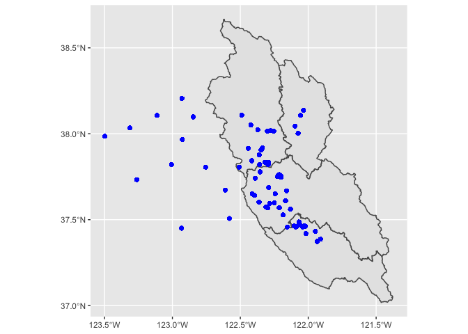
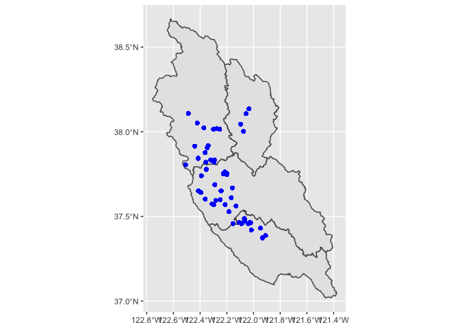

In this document I am cutting the San Francisco Estuary institute (SFEI) microplastic data to the boundaries of the study site and risk regions. To learn more about how the microplastic data was collected, read the [SFEI microplastic report](https://www.sfei.org/documents/understanding-microplastics).

# Required packages

```r
library(IETC) # To load packages use > devtools::install_github("WWU-IETC-R-Collab/IETC")
library(tidyverse)
```

```
## ── Attaching packages ─────────────────────────────────────── tidyverse 1.3.0 ──
```

```
## ✓ ggplot2 3.3.3     ✓ purrr   0.3.4
## ✓ tibble  3.1.0     ✓ dplyr   1.0.5
## ✓ tidyr   1.1.3     ✓ stringr 1.4.0
## ✓ readr   1.4.0     ✓ forcats 0.5.1
```

```
## ── Conflicts ────────────────────────────────────────── tidyverse_conflicts() ──
## x dplyr::filter() masks stats::filter()
## x dplyr::lag()    masks stats::lag()
```

```r
library(data.table)
```

```
## 
## Attaching package: 'data.table'
```

```
## The following objects are masked from 'package:dplyr':
## 
##     between, first, last
```

```
## The following object is masked from 'package:purrr':
## 
##     transpose
```

```r
library(sf)
```

```
## Linking to GEOS 3.8.1, GDAL 3.1.4, PROJ 6.3.1
```

```r
library(knitr)
```

# Loading data and shapefiles 


```r
# Read in SFEI particle data zipfile created in ClipToProjectBoundary and unzip it.
particles <- IETC::unzipShape("https://github.com/WWU-IETC-R-Collab/ClipToProjectBoundary/raw/main/SFEI.particles.locations.zip")
```

```
## Reading layer `SFEI.ID.particles' from data source `/private/var/folders/y9/fm2hb65j7_gf39v8djx1_qyc0000gn/T/RtmpWqnWWs/filecf824895567/SFEI.ID.particles.shp' using driver `ESRI Shapefile'
## Simple feature collection with 43554 features and 12 fields
## Geometry type: POINT
## Dimension:     XY
## Bounding box:  xmin: -123.4973 ymin: 37.37356 xmax: -121.91 ymax: 38.2057
## Geodetic CRS:  WGS 84
```

Next we want to read in the shapefile we are going to use to cut the data. This shapefile is the risk regions selected for the study site. 

```r
# Unzip the shapefile from the GitHub repository "Risk_Region.shapefile"
unzipShape("https://github.com/NSF-Microplastics-Project/Risk_Region.shapefile/raw/main/Data/SFB_RiskRegions_20210304_SP.zip")
```

```
## Reading layer `SFB_RiskRegions_20210304_SP' from data source `/private/var/folders/y9/fm2hb65j7_gf39v8djx1_qyc0000gn/T/RtmpWqnWWs/filecf824dd91ad4/SFB_RiskRegions_20210304_SP.shp' using driver `ESRI Shapefile'
## Simple feature collection with 4 features and 5 fields
## Geometry type: POLYGON
## Dimension:     XY
## Bounding box:  xmin: 1802335 ymin: 557943.6 xmax: 1921947 ymax: 742529.4
## Projected CRS: NAD83(2011) / California zone 3
```

```r
# The code below is not related to above but is indicating the zipfolder in this working directory. I am taking out the .shp to be use when cutting the data. 

SFB.riskregions <- st_read("SFB_RiskRegions_20210304_SP/SFB_RiskRegions_20210304_SP.shp") %>% # transforms shapefile CRS to WGS84 vs NAD83
  st_transform(st_crs(particles))
```

```
## Reading layer `SFB_RiskRegions_20210304_SP' from data source `/Users/emmasharpe/Documents/B. R Studio /Projects/Cutting_by_RiskRegion/SFB_RiskRegions_20210304_SP/SFB_RiskRegions_20210304_SP.shp' using driver `ESRI Shapefile'
## Simple feature collection with 4 features and 5 fields
## Geometry type: POLYGON
## Dimension:     XY
## Bounding box:  xmin: 1802335 ymin: 557943.6 xmax: 1921947 ymax: 742529.4
## Projected CRS: NAD83(2011) / California zone 3
```


# Data Before Cutting 


```r
ggplot() +
  geom_sf(data = SFB.riskregions) +
  geom_sf(data = particles, color = "blue")
```

<!-- -->


```r
particles.within <- particles[SFB.riskregions,] # subsets only data within project study area
```

```
## although coordinates are longitude/latitude, st_intersects assumes that they are planar
## although coordinates are longitude/latitude, st_intersects assumes that they are planar
```

```r
ggplot() +
  geom_sf(data = SFB.riskregions) +
  geom_sf(data = particles.within, color = "blue")
```

<!-- -->

